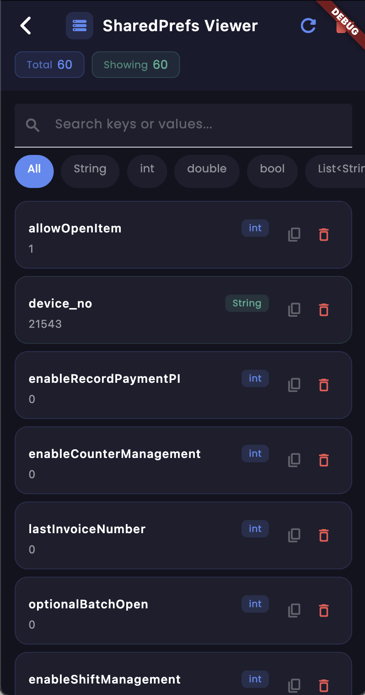

# shared_preference_viewer

A Flutter package that provides a beautiful and simple UI to view, search, and manage your app's `SharedPreferences` in real-time. It's incredibly useful for debugging state and stored data directly from within your application.



## Features

- **Real-time Data Viewing**: See all key-value pairs stored in your app's `SharedPreferences`.
- **Search Capabilities**: Instantly search across keys and values to find specific preferences.
- **Type Filtering**: Filter preferences by data type (`String`, `int`, `double`, `bool`, `List<String>`).
- **Data Management**: Copy values to clipboard, delete individual keys, or clear all preferences with a single tap.
- **Beautiful UI**: Modern, dark-themed UI that is easy to read and navigate.

## Getting Started

Add the dependency to your `pubspec.yaml` file:

```yaml
dependencies:
  shared_preference_viewer: ^0.0.1
```

## Usage

Import the package and safely call the `navigate` function, passing down the `BuildContext` whenever you want to open the viewer.

```dart
import 'package:flutter/material.dart';
import 'package:shared_preference_viewer/shared_preference_viewer.dart';

// In your widget tree (e.g., inside an onPressed callback):
ElevatedButton(
  onPressed: () {
    SharedPrefsViewer.navigate(context);
  },
  child: const Text('Open Preferences Viewer'),
)
```

For a complete working example, check out the `example` folder in the repository.

## Additional information

- If you encounter any issues or want to request a feature, please file an issue on the GitHub repository.
- Contributions are welcome!
